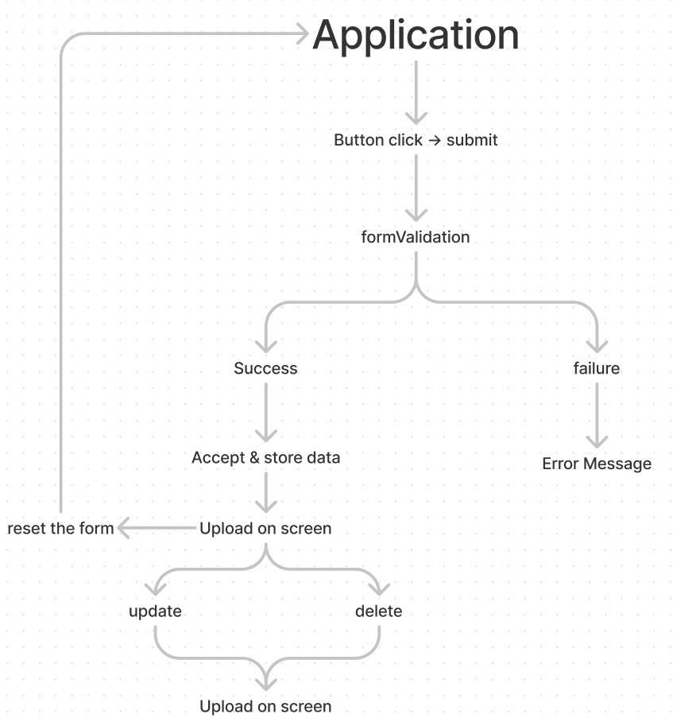

# ⌨️ simple-todo 🔥

A To-do app made using html,css and javascript.

- I made this TOdo App to understand CRUD Operations in JavaScript. 
- CRUD stands for - C: Create, R: Read, U: Update, D: Delete.
- It is a type of mechanism that allows you to create data, read data, edit it, and delete those data.

<a href="https://mrinnnmoy.github.io/simple-todo/" target="_blank">Visit here 🚀</a>

# 🦾 Workflow 

 
 
# 🖼️ Preview 

#  Made with ❤️ by <a href="https://www.linkedin.com/in/mrinnnmoy/" target="_blank">Mrinmoy Porel</a>
 
